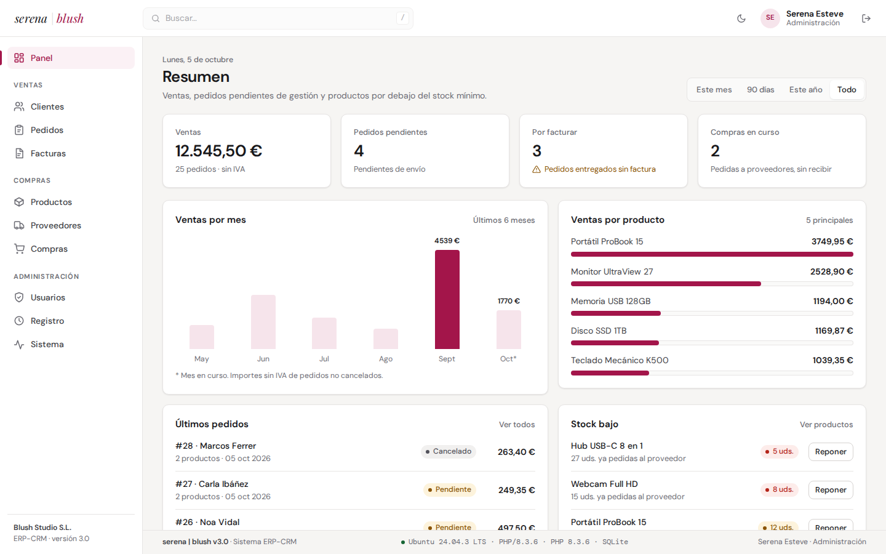

# serena | blush · ERP-CRM

Mini ERP-CRM hecho para el **RA1 de 0491 · Sistemas de gestión empresarial** (DAM2).
Parte de la estructura de **Crimson**, el proyecto de clase: `api/`, `nucleo/`, `modulos/` y componentes con `data-include`. A partir de ahí añade:

- base de datos real
- usuarios con roles
- ventas con varias líneas, compras a proveedores, control de stock y facturación con rectificativas
- copias de seguridad
- diagnóstico del sistema y registro de operaciones
- pruebas automáticas

La interfaz es sobria y mantiene la identidad de [serenaesteve.com](https://serenaesteve.com): logotipo, tipografía DM Sans y acento frambuesa.

- **Autora:** Serena Esteve
- **Versión:** 3.0, 05/10/2026
- **Pila:** Ubuntu 24.04 · Apache 2.4 · PHP 8.3 · SQLite o MySQL · HTML + CSS + JavaScript sin librerías



---

## Acceso

| Rol | Email | Contraseña | Qué puede hacer |
|---|---|---|---|
| Administración | `serena@blush.test` | `blush2026` | Todo: rectificar facturas, borrar, Productos, Compras, Usuarios, Sistema y copias de seguridad |
| Comercial | `pablo@blush.test` | `blush2026` | Ver todo; crear y editar clientes y pedidos; facturar. No puede borrar, rectificar, modificar productos ni compras, ni ver Usuarios o Sistema |

Los permisos se comprueban **en el servidor**; el frontend solo oculta lo que no se puede hacer. Cada usuario cambia su contraseña pulsando su nombre en la barra superior.

## Qué hace

| Sección | Módulo | Para qué sirve |
|---|---|---|
| | **Panel** | Ventas del periodo elegido (mes, 90 días, año, todo), pedidos pendientes, pedidos por facturar, compras en curso, ventas por mes y por producto, últimos pedidos y stock bajo con botón **Reponer** |
| Ventas | **Clientes** | CRM con estado *potencial / activo / inactivo*. El nombre abre su **ficha**: datos, total comprado, ticket medio e historial |
| | **Pedidos** | **Varias líneas** por pedido. Cada línea guarda el precio del momento de la venta y **descuenta stock** (no deja vender sin existencias). Los entregados se **facturan** con un clic y quedan bloqueados |
| | **Facturas** | Numeración correlativa por año (`F2026-0001`), IVA, una línea por producto y **hoja A4 imprimible**. Una factura emitida no se borra: se anula con una **factura rectificativa** (`R2026-0001`, importes en negativo y motivo) |
| Compras | **Productos** | Catálogo con precio, stock y aviso de stock bajo |
| | **Proveedores** | Datos de contacto |
| | **Compras** | Pedidos a proveedores con varias líneas y coste. Al marcarlas como **recibidas**, el stock sube |
| Administración | **Usuarios** | Contraseñas cifradas (`password_hash`) y rol |
| | **Registro** | Altas, ediciones, borrados, facturas, rectificativas, copias y accesos, con **quién** lo hizo. Exportable a `.md` |
| | **Sistema** | Diagnóstico en directo de SO, Apache, PHP, extensiones, límites, base de datos y seguridad, y **copias de seguridad** (descargar y restaurar en JSON, válidas para SQLite y MySQL) |

En todas las tablas: buscador (atajo `/`), filtro por fechas, **ordenación y paginación en el servidor** y **exportación a CSV** para Excel. Modo claro/oscuro y diseño adaptado a móvil.

### Relación con los criterios del RA1

| Criterio | Dónde se trabaja |
|---|---|
| a, b, c) ERP-CRM del mercado, licencias, comparativa | Esta aplicación implementa los módulos típicos de un ERP-CRM (CRM, ventas, facturación, compras, inventario) para entender cómo funcionan |
| d) SO adecuado | Vista **Sistema** → *Sistema operativo*; `Dockerfile` |
| e) SGBD adecuado | La misma aplicación funciona con **SQLite y MySQL** (`api/config.php`, `docker-compose.yml`) |
| f) Verificar configuraciones | Vista **Sistema** (39 comprobaciones), `scripts/configurar-servidor.sh`, capturas [antes](docs/capturas/sistema-antes.png) / después |
| g) Documentar operaciones | Vista **Registro** (automático, con usuario) + [Operaciones realizadas](#operaciones-realizadas) |
| h) Documentar incidencias | [Incidencias](#incidencias) |

---

## Mejoras respecto a Crimson (versión de clase)

| | Crimson 0.2 | Blush 3.0 |
|---|---|---|
| Datos | JSON escrito a mano en `api.php` | SQLite o MySQL; tablas creadas y migradas automáticamente |
| Operaciones | Solo lectura | CRUD completo con líneas, paginación, ordenación, filtros y CSV |
| Lógica de negocio | — | Stock, precio guardado, compras, facturación con IVA, rectificativas |
| Usuarios | Nombre fijo en el HTML | Inicio de sesión, contraseñas cifradas y roles |
| Módulos | 3 entradas de menú que muestran lo mismo | 11 vistas; un módulo nuevo se añade solo en `api/esquema.php` |
| Seguridad | `$_GET['bloque']` sin comprobar | Consultas preparadas, listas blancas, sin XSS, cookie `HttpOnly` + `SameSite`, cabecera anti-CSRF, BD bloqueada |
| Integridad | — | Claves foráneas y transacciones |
| Pruebas | — | 27 pruebas de API + 12 en navegador |
| Despliegue | Copiar a `/var/www/html` | Apache, o `docker compose up` con MySQL |

---

## Instalación

### Con Apache (como en clase)

```bash
cd /var/www/html
git clone git@github.com:serenaesteve/Sistema-de-gesti-n-empresarial.git
cd Sistema-de-gesti-n-empresarial
sudo chown www-data:www-data datos          # Apache tiene que poder escribir la BD (en clase: chmod 777 datos)
sudo bash scripts/configurar-servidor.sh    # opcional: gd, intl, límites de php.ini y zona horaria
```

Abrir `http://localhost/Sistema-de-gesti-n-empresarial/`. La primera visita crea la base de datos con seis meses de datos de demostración.

**Requisitos:** PHP ≥ 8.1 con `pdo_sqlite` (o `pdo_mysql`), `json` y `mbstring`, y Apache con `AllowOverride All` para que se aplique `datos/.htaccess`.

**Con MySQL:** ejecutar `sudo mysql < scripts/mysql.sql` y cambiar `'motor' => 'mysql'` en `api/config.php`.

### Con Docker (Apache + PHP + MySQL)

```bash
docker compose up -d --build                # → http://localhost:8080
```

La imagen ya trae las extensiones y la configuración de `php.ini` recomendadas.

> ⚠️ Los archivos de Docker no se han podido probar en el equipo de desarrollo, porque el usuario no tiene permiso sobre `docker.sock`. Ver incidencia I-11.

### Compatibilidad SQLite / MySQL

El código tiene en cuenta las diferencias entre los dos motores:

- `AUTO_INCREMENT` frente a `AUTOINCREMENT`.
- `SHOW COLUMNS` frente a `PRAGMA table_info`.
- `time_zone = '+00:00'` para que las fechas coincidan con SQLite.
- `LIMIT` con enteros ya validados, porque con prepares emulados MySQL los pondría entre comillas.
- Tablas de líneas creadas después de las tablas a las que referencian, porque InnoDB no admite claves foráneas a tablas que aún no existen.

## Pruebas automáticas

```bash
bash tests/ejecutar.sh                      # 27 pruebas de API + 12 en navegador (si Playwright está instalado)
SOLO_API=1 bash tests/ejecutar.sh           # solo API (PHP + curl, sin dependencias)
CAPTURAS=docs/capturas bash tests/ejecutar.sh   # además, regenera las capturas de la documentación
```

Arrancan su propio servidor (`php -S`) con una **base de datos temporal**, así que no tocan los datos reales ni necesitan Apache. Cubren:

- sesiones, permisos y la protección CSRF
- validación
- stock con varias líneas y transacciones deshechas
- precio guardado en el pedido
- compras
- facturación y rectificativas
- paginación, filtros y CSV
- usuarios y cambio de contraseña
- copias de seguridad
- registro y diagnóstico

---

## Estructura

```
├── index.html · factura.html       Aplicación y factura imprimible
├── api/
│   ├── api.php                     Punto de entrada, sesión y enrutado
│   ├── config.php                  Motor de BD, empresa emisora, IVA (también por variables de entorno)
│   ├── esquema.php                 Módulos, campos, líneas y permisos (fuente única)
│   ├── auth.php                    Inicio de sesión, roles y permisos
│   ├── bd.php                      Conexión, tablas, migraciones y datos de demostración
│   ├── crud.php                    Listar / paginar / filtrar / CSV / crear / editar / borrar, con líneas
│   ├── negocio.php                 Stock, precios, compras, facturación y rectificativas
│   ├── copia.php                   Copias de seguridad y cambio de contraseña
│   ├── panel.php · sistema.php     Indicadores y diagnóstico
├── nucleo/                         Componentes HTML, estilos y JS comunes
├── modulos/                        Vistas: acceso, panel, crud (genérica), ficha-cliente, registro, sistema, mi-clave
├── tests/                          api.php, navegador.py y ejecutar.sh
├── scripts/                        configurar-servidor.sh y mysql.sql (requieren sudo)
├── Dockerfile · docker-compose.yml
├── docs/capturas/                  Capturas y facturas de ejemplo
└── datos/                          erp.sqlite (se crea solo; no se sube a git) + .htaccess
```

## API

| Método | `api/api.php?recurso=…` | Acción |
|---|---|---|
| GET · POST | `sesion` · `entrar` · `salir` · `mi-clave` | Sesión y contraseña |
| GET | `pedidos&q=&desde=&hasta=&orden=&dir=&pagina=` | Listado (`formato=csv` para descargar; `cliente_id=3` para filtrar) |
| GET | `pedidos&id=3` | Un registro con sus `lineas` |
| POST · PUT · DELETE | `pedidos[&id=3]` | Alta · edición · borrado (cuerpo JSON con `lineas: [{producto_id, cantidad}]`) |
| POST | `facturar&id=5` · `rectificar&id=7` | Facturar un pedido · rectificar una factura `{motivo}` |
| GET · POST | `copia` · `restaurar` | Copia de seguridad en JSON |
| GET | `menu` · `esquema` · `info` · `panel&periodo=` · `registro` · `sistema` | Datos de la interfaz |

Las escrituras exigen la cabecera `X-Blush: 1`. Respuestas: `{"ok": true, "datos": …}` o `{"ok": false, "error": "…", "errores": {"lineas.1.cantidad": "…"}}` con su código HTTP (400, 401, 403, 404, 405, 409, 422, 500).

---

## Operaciones realizadas

| Nº | Operación | Comando / acción | Resultado |
|---|---|---|---|
| 1 | Analizar el proyecto de clase | Lectura de `011-Crimson` | Se mantiene su arquitectura |
| 2 | Comprobar el SO y el software | `cat /etc/os-release`, `apache2 -v`, `php -v`, `mysql --version` | Ubuntu 24.04.3, Apache 2.4.58, PHP 8.3.6, MySQL 8.0.46 |
| 3 | Comprobar los drivers de BD | `php -m \| grep -i pdo` | `pdo_mysql` y `pdo_sqlite` |
| 4 | Crear la estructura y dar permisos | `chmod 777 datos` | Apache puede crear `erp.sqlite` |
| 5 | Comprobar que la BD no se descarga | `curl -I …/datos/erp.sqlite` con y sin `.htaccess` | 200 sin `.htaccess` → **403** con él |
| 6 | v1: API + interfaz | `curl` y Playwright | Correcto |
| 7 | v2: usuarios, stock, facturas, CSV | `curl` y Playwright | Correcto |
| 8 | v2.1: rediseño profesional | Capturas en claro, oscuro y móvil | Correcto |
| 9 | v3: pedidos con líneas, compras, rectificativas, copias, contraseña, filtros | `bash tests/ejecutar.sh` | **27/27 API · 12/12 navegador** |
| 10 | Captura de Sistema «antes» (Apache) | [sistema-antes.png](docs/capturas/sistema-antes.png) | 0 errores · **8 avisos** |
| 11 | Preparar scripts de servidor y Docker | `scripts/`, `Dockerfile`, `docker-compose.yml` | Pendientes de ejecutar (requieren `sudo` / Docker) |

## Incidencias

| Nº | Incidencia | Causa | Solución | Estado |
|---|---|---|---|---|
| I-01 | `Access denied for user 'serena'@'localhost'` en MySQL | En Ubuntu, `root` de MySQL entra por `auth_socket` y no había usuario para la app | SQLite mientras tanto; `scripts/mysql.sql` crea un usuario con permisos solo sobre `blush_erp` | ⏳ Pendiente de `sudo` |
| I-02 | Apache no podría crear la BD (detectado antes de instalar) | `datos/` pertenece a `serena`; Apache escribe como `www-data` | `chmod 777 datos` (producción: `chown www-data`). La API y Sistema lo avisan | ✅ Prevenida |
| I-03 | `datos/erp.sqlite` se podía descargar (HTTP 200) | Está dentro de `/var/www/html` | `datos/.htaccess` (`000-default.conf` tiene `AllowOverride All`). Verificado: 403; Sistema lo comprueba en cada visita | ✅ Resuelta |
| I-04 | `date.timezone` sin definir: PHP usa UTC | Valor por defecto desde PHP 8.2 | La app fija `Europe/Madrid`; el script y el `Dockerfile` lo definen en `php.ini` | ✅ App · ⏳ `php.ini` |
| I-05 | La API devolvía las horas 2 h atrasadas | SQLite guarda `CURRENT_TIMESTAMP` en UTC | El frontend las interpreta como UTC; en MySQL `time_zone = '+00:00'` | ✅ Resuelta |
| I-06 | Faltan `gd` e `intl` | No vienen con PHP por defecto | `scripts/configurar-servidor.sh` / `Dockerfile` | ⏳ Pendiente de `sudo` |
| I-07 | Límites bajos en el `php.ini` de Apache | Valores por defecto de Ubuntu (el `php.ini` de la terminal es otro) | `scripts/configurar-servidor.sh` (con copia de seguridad) | ⏳ Pendiente de `sudo` |
| I-08 | En la v1, cambiar el precio de un producto cambiaba los pedidos antiguos | El total usaba el precio actual del catálogo | Precio guardado en cada línea del pedido | ✅ Resuelta |
| I-09 | Riesgo de operaciones a medias | Varias consultas por operación | Transacciones con `rollBack()`; probado: un pedido sin stock no altera nada | ✅ Resuelta |
| I-10 | La BD de la v2 (un producto por pedido) no encaja con la v3 (varias líneas) | Cambio de estructura | La app detecta la BD antigua, la guarda como `erp-v2-FECHA.sqlite` y crea una nueva. En MySQL avisa para vaciarla | ✅ Resuelta |
| I-11 | No se puede probar Docker en el equipo | El usuario no tiene permiso sobre `/var/run/docker.sock` y falta el plugin `compose` | `sudo usermod -aG docker $USER` y `sudo apt install docker-compose-plugin` | ⏳ Pendiente de `sudo` |
| I-12 | Con `php -S` (pruebas), Sistema marca la BD como descargable | El servidor integrado de PHP no aplica `.htaccess` | Correcto: el aviso es real en ese servidor; las pruebas usan una BD temporal fuera del proyecto | ✅ Documentada |
